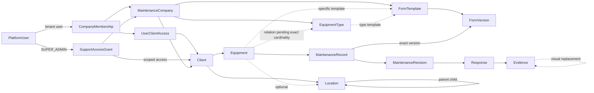
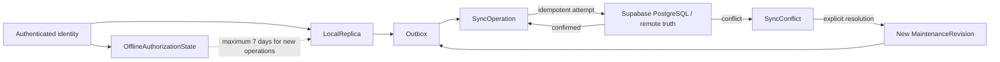
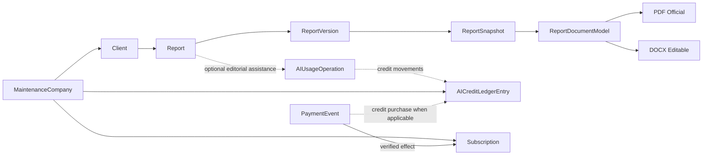

# 02 — Modelo de dominio conceptual del MVP

> **Ruta normativa/objetivo:** `docs/product/02-domain-model.md`  
> **Estado:** **APROBADO — modelo de dominio conceptual del MVP**  
> **Fase:** Fase 0 — documento derivado  
> **Estado de Fase 0:** **EN CURSO**  
> **Baseline normativa:** `docs/product/01-product-definition.md`  
> **Naturaleza:** modelo conceptual de dominio; **NO constituye diseño SQL, esquema físico ni definición de políticas RLS**

---

## 1. Propósito y autoridad

Este documento define el modelo de dominio conceptual del MVP del SaaS B2B multiempresa para empresas de mantenimiento.

Su objetivo es establecer:

- qué conceptos existen en el dominio;
- qué significado tiene cada concepto;
- cómo se relacionan;
- quién es propietario de cada dato;
- cuáles son sus ciclos de vida;
- qué información es mutable o inmutable;
- qué invariantes deben preservarse;
- cuáles son las fronteras conceptuales entre módulos;
- qué decisiones continúan realmente abiertas antes de fases posteriores.

La fuente normativa principal es `docs/product/01-product-definition.md`, que se encuentra **APROBADA como baseline normativa de producto**.

El orden de autoridad aplicado es:

1. `01-product-definition.md`;
2. `00-master-product-brief.md`;
3. decisiones explícitamente aprobadas dentro del Project que no hayan sido sustituidas posteriormente.

Ante una contradicción entre este documento y `01-product-definition.md`, prevalece `01-product-definition.md` y este documento debe corregirse.

### 1.1 Alcance

Este documento define **qué existe y qué significa**.

No define todavía:

- tablas;
- columnas;
- claves físicas;
- índices;
- migraciones;
- funciones PostgreSQL;
- políticas RLS concretas;
- buckets de Storage;
- endpoints;
- Server Actions;
- componentes Next.js;
- estructura Dexie concreta;
- algoritmos definitivos de sincronización;
- state machines concretas de Mercado Pago;
- implementación definitiva del ledger IA.

Las decisiones de persistencia posteriores podrán representar físicamente estos conceptos de distintas maneras, siempre que preserven las reglas e invariantes aprobadas.

### 1.2 Comprobación de coherencia previa

No se detectan contradicciones bloqueantes entre las fuentes aprobadas que impidan construir un modelo de dominio coherente.

Las contradicciones declaradas como resueltas en `01-product-definition.md` permanecen cerradas.

En particular:

- `SUPER_ADMIN` es global y no pertenece a tenants;
- `COMPANY_ADMIN` y `TECHNICIAN` pertenecen exactamente a un tenant;
- no existen sucursales en el MVP;
- no existen órdenes de trabajo;
- no existen asignaciones previas de técnicos a mantenimientos;
- las correcciones generan nuevas revisiones;
- las evidencias sustituidas visualmente se conservan;
- no existe Last Write Wins silencioso para registros críticos;
- los datos offline se aíslan por identidad;
- finalización y sincronización son estados independientes;
- campos pertenecientes a distintas versiones de formularios son independientes;
- DO-075 está resuelta: la autorización offline puede mantenerse como máximo 7 días desde la última validación online; la revocación conocida por el servidor debe aplicarse al recuperar conexión; vencido el período no pueden iniciarse nuevas operaciones sin revalidación; el trabajo ya capturado no se elimina.

---

# 2. Lenguaje ubicuo

Los siguientes términos constituyen el lenguaje ubicuo del MVP y deben utilizarse consistentemente.

| Término | Definición |
|---|---|
| **Plataforma** | El SaaS completo y su ámbito global. Contiene conceptos globales como `SUPER_ADMIN` y el registro de empresas de mantenimiento. No equivale a un tenant. |
| **Empresa de mantenimiento / Tenant** | `MaintenanceCompany`. Empresa que utiliza el SaaS. Constituye la frontera primaria de propiedad y aislamiento multiempresa. |
| **Usuario / PlatformUser** | Identidad autenticada reconocida por la plataforma. La autenticación por sí sola no determina pertenencia tenant ni permisos operativos. |
| **Membership / Pertenencia** | `CompanyMembership`. Relación entre un `PlatformUser` tenant y exactamente una `MaintenanceCompany`, con rol y estado. |
| **Cliente industrial / Client** | Organización atendida por una empresa de mantenimiento. No es tenant ni usuario del SaaS en el MVP. |
| **Ubicación / Location** | Nodo arbitrario dentro del árbol de ubicaciones de un cliente. No implica niveles estructurales rígidos. |
| **Tipo de equipo / EquipmentType** | Clasificación privada creada por una empresa de mantenimiento para sus equipos. |
| **Equipo / Equipment** | Activo técnico mantenido. Pertenece a un cliente y puede asociarse a un nodo de ubicación. |
| **Formulario / FormTemplate** | Formulario lógico administrado por un tenant. Tiene estado activo/archivado y varias versiones a lo largo de su vida. |
| **Versión de formulario / FormVersion** | Definición concreta del formulario en estado borrador o publicada. Una publicada es inmutable. |
| **Campo / FormField** | Ítem de captura perteneciente exclusivamente a una `FormVersion`. No conserva identidad lógica estable entre versiones diferentes en el MVP. |
| **Mantenimiento / MaintenanceRecord** | Identidad lógica de un registro técnico de mantenimiento autónomo. No depende de orden de trabajo ni de asignación previa. |
| **Revisión de mantenimiento / MaintenanceRevision** | Estado histórico inmutable de un mantenimiento finalizado. Una corrección crea una revisión nueva. |
| **Respuesta / Response** | Valor o contenido capturado para un campo de la versión exacta del formulario usada por un mantenimiento. |
| **Evidencia / Evidence** | Fotografía vinculada a una respuesta como evidencia técnica. Es conceptualmente distinta de una respuesta de campo de tipo imagen. |
| **Reemplazo visual de evidencia** | Relación por la cual una evidencia nueva pasa a utilizarse visualmente en lugar de una anterior sin eliminar ni modificar la original. |
| **Operación offline** | Operación iniciada y persistida localmente sin requerir confirmación remota inmediata. |
| **Outbox** | Cola durable de operaciones locales pendientes de sincronización. |
| **SyncOperation / OutboxItem** | Operación de sincronización identificable e idempotente almacenada en la outbox. |
| **Conflicto de sincronización / SyncConflict** | Divergencia que impide aplicar automáticamente una operación sin riesgo de sobrescribir silenciosamente estado crítico. |
| **Informe / Report** | Informe lógico mensual correspondiente a un cliente. El número oficial se asigna al finalizarlo. |
| **Versión de informe / ReportVersion** | Generación `v1`, `v2`, etc. de un mismo informe lógico. |
| **Snapshot / ReportSnapshot** | Representación inmutable de los datos utilizados para una versión concreta de informe. |
| **Plantilla de informe / ReportTemplate** | Configuración tenant-owned de estructura, branding y presentación de informes. |
| **ReportDocumentModel** | Modelo intermedio común de documento a partir del cual se generan PDF y DOCX. |
| **Operación IA / AIUsageOperation** | Solicitud de asistencia editorial mediante IA realizada en el contexto de informes. |
| **Movimiento de créditos / AICreditLedgerEntry** | Movimiento inmutable del ledger de créditos IA de un tenant. |
| **Suscripción / Subscription** | Concepto comercial que determina el derecho de acceso SaaS de la empresa. |
| **Evento de pago / PaymentEvent** | Evento proveniente del proveedor de pagos que debe verificarse e idempotentizarse antes de producir efectos. |
| **Evento de auditoría / AuditEvent** | Registro no eliminable por operación normal de una acción sensible cuya trazabilidad está requerida. |
| **Concesión de soporte excepcional / SupportAccessGrant** | Autorización explícita, acotada y revocable para que `SUPER_ADMIN` acceda excepcionalmente a partes determinadas de un tenant. |
| **Autorización offline** | Estado local derivado de una validación online previa que permite iniciar operaciones temporalmente offline dentro del máximo de 7 días aprobado. |
| **Estado de negocio** | Estado que expresa significado funcional, por ejemplo que un mantenimiento está finalizado. |
| **Estado de sincronización** | Estado técnico independiente que expresa si cambios locales están pendientes, confirmados o en conflicto con la fuente remota. |

## 2.1 Términos que no deben tratarse como sinónimos

No deben confundirse:

- `PlatformUser` y `CompanyMembership`;
- empresa de mantenimiento y cliente industrial;
- ubicación y sucursal del tenant;
- `FormTemplate` y `FormVersion`;
- campo de tipo imagen y evidencia;
- `MaintenanceRecord` y `MaintenanceRevision`;
- finalización y sincronización;
- `Report`, `ReportVersion` y `ReportSnapshot`;
- snapshot y archivo PDF/DOCX;
- suscripción y créditos IA;
- historial de dominio y auditoría de seguridad.

---

# 3. Bounded contexts o módulos conceptuales

Los siguientes contextos representan fronteras conceptuales. No implican microservicios; el producto mantiene una arquitectura modular dentro del mismo proyecto Next.js.

## 3.1 Identity & Access

Responsable de:

- `PlatformUser`;
- alta y verificación de usuarios;
- `CompanyMembership`;
- roles fijos;
- habilitación, deshabilitación y reintegración;
- `UserClientAccess`;
- acceso excepcional de soporte.

No administra directamente mantenimientos, activos o informes.

---

## 3.2 Tenant Management

Responsable de:

- `MaintenanceCompany`;
- ciclo general del tenant;
- configuración tenant-wide;
- relación conceptual del tenant con sus capacidades comerciales.

`MaintenanceCompany` es frontera de propiedad, no un agregado transaccional que deba contener todos los recursos del tenant.

---

## 3.3 Customer & Asset Management

Responsable de:

- `Client`;
- árbol de `Location`;
- `EquipmentType`;
- `Equipment`;
- pertenencia de activos;
- asociación conceptual de formularios a tipos/equipos.

No contiene conceptos específicos de HVAC en el núcleo.

---

## 3.4 Form Definition

Responsable de:

- `FormTemplate`;
- `FormVersion`;
- `FormSection`;
- `FormField`;
- estructuras repetibles;
- tablas/matrices;
- condicionales simples;
- publicación;
- archivo;
- conservación histórica.

No ejecuta mantenimientos.

---

## 3.5 Maintenance Execution

Responsable de:

- `MaintenanceRecord`;
- `MaintenanceRevision`;
- `Response`;
- `Evidence`;
- reemplazos visuales;
- finalización;
- correcciones.

No introduce:

- órdenes de trabajo;
- recurrencias;
- asignaciones previas de técnicos.

---

## 3.6 Offline Synchronization

Responsable de:

- `LocalReplica`;
- outbox durable;
- `SyncOperation`;
- idempotencia;
- fotografías pendientes;
- `SyncConflict`;
- aislamiento local por identidad;
- autorización offline.

Este contexto transporta y reconcilia operaciones, pero no redefine las reglas funcionales de los demás módulos.

---

## 3.7 Reporting

Responsable de:

- `Report`;
- `ReportVersion`;
- `ReportSnapshot`;
- `ReportTemplate`;
- `ReportDocumentModel`;
- generación coherente de PDF y DOCX.

Consume estados históricos de mantenimiento sin modificarlos.

---

## 3.8 AI Credits

Responsable de:

- `AIUsageOperation`;
- asistencia editorial;
- `AICreditLedgerEntry`;
- consumo, confirmación o compensación conceptual.

La IA no constituye fuente de verdad de datos técnicos.

---

## 3.9 Subscription & Payments

Responsable de:

- `Subscription`;
- derecho comercial de acceso;
- período promocional;
- gracia;
- suspensión;
- reactivación;
- `PaymentEvent`.

Suscripción y créditos IA permanecen separados.

---

## 3.10 Audit

Responsable de registrar acciones sensibles explícitamente requeridas.

No reemplaza:

- versionado de formularios;
- revisiones de mantenimiento;
- snapshots;
- ledger de créditos;
- eventos de pago.

---

## 3.11 Notifications

Las notificaciones push forman parte del MVP cuando existe conectividad.

El catálogo concreto de eventos continúa pendiente mediante `DO-073`.

---

## 3.12 Dashboard

El dashboard forma parte del MVP, pero conceptualmente debe tratarse principalmente como proyecciones/read models de otros módulos.

Las métricas y filtros concretos continúan pendientes mediante `DO-074`.

---

# 4. Entidades y Value Objects conceptuales

## 4.1 `PlatformUser`

**Propósito:** representar una identidad autenticada de plataforma.

**Propietario:** plataforma.

**Identidad conceptual:** global.

**Relaciones principales:**

- puede representar un `SUPER_ADMIN`;
- puede poseer una `CompanyMembership`;
- puede ser actor de auditoría;
- puede ser sujeto de acceso excepcional.

**Ciclo de vida:** creada/reconocida → verificada según flujo → activa; su identidad e historial no desaparecen al deshabilitar una membership.

**Mutabilidad:** mutable en datos propios permitidos.

**Regla relevante:** autenticación no equivale a autorización tenant.

---

## 4.2 `VerificationChallenge`

**Propósito:** representar el código emitido durante un alta.

**Propietario:** plataforma.

**Identidad conceptual:** emisión concreta de un código.

**Ciclo de vida:**

- emitido;
- validado;
- vencido;
- agotado por intentos;
- invalidado por reenvío.

**Reglas:**

- vigencia de 8 horas;
- máximo 3 intentos;
- cada reenvío genera una nueva instancia;
- un reenvío invalida inmediatamente la anterior;
- cada emisión dispone de sus propios intentos;
- una emisión vencida no se recupera ni reutiliza.

No se define aquí su representación criptográfica ni física.

---

## 4.3 `MaintenanceCompany`

**Propósito:** representar una empresa de mantenimiento y tenant.

**Propietario global:** plataforma como registro de tenants.

**Identidad conceptual:** tenant único.

**Relaciones:**

- memberships;
- clientes;
- tipos de equipos;
- formularios;
- informes;
- créditos;
- suscripción;
- auditoría.

**Ciclo de vida:** creada → activa inmediatamente → eventualmente acceso comercial suspendido/reactivado.

**Mutabilidad:** datos administrativos configurables.

**Reglas:**

- no posee sucursales en el MVP;
- suspensión comercial no elimina información.

---

## 4.4 `CompanyMembership`

**Propósito:** representar la pertenencia de un usuario tenant a una empresa.

**Propietario:** `MaintenanceCompany`.

**Identidad conceptual:** pertenencia concreta de un `PlatformUser`.

**Relaciones:**

- un `PlatformUser`;
- exactamente una `MaintenanceCompany`;
- un rol fijo;
- cero o más `UserClientAccess`.

**Ciclo de vida:**

- habilitada;
- deshabilitada/revocada;
- reintegrada.

**Mutabilidad:**

- rol mutable por actor autorizado;
- alcance de clientes mutable;
- estado mutable;
- historial conservado.

**Reglas:**

- sólo roles `COMPANY_ADMIN` o `TECHNICIAN`;
- ningún usuario tenant pertenece a más de un tenant;
- deshabilitación no elimina identidad ni historial.

---

## 4.5 `UserClientAccess`

**Propósito:** representar autorización explícita de una membership sobre un cliente.

**Propietario:** `MaintenanceCompany`.

**Identidad conceptual:** autorización membership-cliente.

**Relaciones:**

- una `CompanyMembership`;
- un `Client`.

**Ciclo de vida:** concedida → modificada/revocada.

**Reglas:**

- membership y cliente deben pertenecer al mismo tenant;
- un cliente de otro tenant nunca puede asignarse;
- para `TECHNICIAN`, el acceso al cliente incluye todas las ubicaciones y equipos de ese cliente;
- no introduce permisos independientes por ubicación, equipo o mantenimiento.

---

## 4.6 `SupportAccessGrant`

**Propósito:** representar una concesión excepcional de soporte a `SUPER_ADMIN`.

**Propietario:** tenant concedente.

**Identidad conceptual:** concesión concreta.

**Relaciones:**

- `MaintenanceCompany` concedente;
- identidad `SUPER_ADMIN`;
- clientes autorizados;
- scopes autorizados.

**Ciclo de vida:**

- concedida;
- modificada;
- revocada.

**Mutabilidad:** el alcance puede modificarse mientras esté vigente.

**Scopes operativos aprobados por cliente:**

- información del cliente;
- ubicaciones;
- equipos;
- mantenimientos;
- formularios/respuestas;
- evidencias;
- informes.

**Scopes tenant-wide aprobados:**

- usuarios/permisos;
- suscripción/pagos;
- créditos IA.

**Reglas:**

- no es un bypass general;
- es explícita;
- limitada;
- revocable;
- auditable;
- su uso efectivo también debe auditarse.

---

## 4.7 `Client`

**Propósito:** representar un cliente industrial atendido.

**Propietario:** `MaintenanceCompany`.

**Identidad conceptual:** cliente dentro del tenant.

**Relaciones:**

- ubicaciones;
- equipos;
- usuarios autorizados;
- mantenimientos derivados de sus equipos;
- informes.

**Ciclo de vida:** administrado por la empresa.

**Mutabilidad:** datos maestros editables.

**Regla:** no es usuario del SaaS ni tenant.

---

## 4.8 `Location`

**Propósito:** representar un nodo de ubicación de un cliente.

**Propietario:** `MaintenanceCompany`, subordinado a un `Client`.

**Identidad conceptual:** nodo del árbol.

**Relaciones:**

- exactamente un `Client`;
- cero o una `Location` padre;
- cero o más hijas;
- cero o más equipos.

**Mutabilidad:** administrable mientras conserve coherencia jerárquica.

**Reglas:**

- profundidad arbitraria;
- padre e hijo pertenecen al mismo cliente;
- no existen niveles rígidos de dominio.

---

## 4.9 `EquipmentType`

**Propósito:** clasificar equipos.

**Propietario:** `MaintenanceCompany`.

**Identidad conceptual:** tipo privado dentro del tenant.

**Relaciones:**

- equipos del mismo tenant;
- formulario aplicable a nivel de tipo cuando corresponda.

**Mutabilidad:** administrable.

**Reglas:**

- no es catálogo global;
- no introduce categorías específicas de HVAC en el núcleo.

La obligatoriedad de asignar un tipo a cada equipo no está definida expresamente en la baseline y se mantiene abierta.

---

## 4.10 `Equipment`

**Propósito:** representar un activo técnico mantenido.

**Propietario:** `MaintenanceCompany`, subordinado a un `Client`.

**Identidad conceptual:** equipo dentro del tenant.

**Relaciones:**

- exactamente un cliente;
- opcionalmente una ubicación;
- relación con `EquipmentType`;
- opcionalmente formulario específico;
- mantenimientos.

**Ciclo de vida:** administrado durante su existencia en el cliente.

**Mutabilidad:** datos maestros editables.

**Reglas:**

- una ubicación asociada debe ser del mismo cliente;
- el formulario específico del equipo tiene prioridad absoluta sobre el asociado al tipo;
- QR e IoT quedan fuera del MVP.

---

## 4.11 `FormTemplate`

**Propósito:** representar el formulario lógico.

**Propietario:** `MaintenanceCompany`.

**Identidad conceptual:** formulario estable a través de varias versiones.

**Relaciones:**

- una o más `FormVersion` durante su vida;
- asociaciones con tipos/equipos.

**Ciclo de vida:**

- activo;
- archivado.

**Mutabilidad:** su configuración actual puede evolucionar mediante nuevas versiones.

**Reglas:**

- archivar impide nuevos usos;
- no afecta registros históricos.

---

## 4.12 `FormVersion`

**Propósito:** representar una definición concreta de formulario.

**Propietario:** tenant propietario del `FormTemplate`.

**Identidad conceptual:** versión concreta.

**Relaciones:**

- un `FormTemplate`;
- secciones;
- campos;
- estructuras repetibles;
- matrices;
- reglas condicionales;
- mantenimientos que la hayan utilizado.

**Ciclo de vida:**

- borrador;
- publicada.

**Mutabilidad:**

- borrador: mutable;
- publicada: inmutable.

**Reglas:**

- editar un formulario publicado crea un borrador nuevo;
- publicar ese borrador crea una nueva versión vigente;
- versiones publicadas anteriores se conservan;
- un mantenimiento conserva la versión exacta utilizada.

---

## 4.13 `FormSection`

**Propósito:** agrupar y ordenar contenido.

**Propietario:** una `FormVersion`.

**Identidad conceptual:** específica de esa versión.

**Mutabilidad:**

- mutable en borrador;
- inmutable tras publicación.

No es una entidad reutilizable global.

---

## 4.14 `FormField`

**Propósito:** representar un ítem de captura.

**Propietario:** una única `FormVersion`.

**Identidad conceptual:** específica de esa versión.

**Relaciones:**

- versión;
- sección o estructura que lo contiene;
- reglas condicionales;
- respuestas de mantenimientos que utilicen esa versión.

**Tipos MVP:**

- texto corto;
- texto largo;
- entero;
- decimal;
- select;
- selección múltiple;
- checkbox;
- imágenes;
- archivos;
- tablas/matrices;
- estructuras necesarias para grupos repetibles.

**Configuraciones relevantes:**

- obligatoriedad;
- unidad;
- mínimo;
- máximo;
- evidencia fotográfica;
- reglas condicionales simples.

**Invariante:** campos de versiones diferentes son entidades independientes aunque visualmente parezcan el mismo campo.

---

## 4.15 `ConditionalRule`

**Propósito:** representar lógica condicional simple de formulario.

**Propietario:** `FormVersion`.

**Identidad conceptual:** regla version-bound.

**Reglas permitidas:**

- SI campo = valor → mostrar campo;
- SI campo = valor → hacer obligatorio campo.

**Invariantes:**

- campos referenciados deben corresponder a esa versión;
- no existen expresiones arbitrarias;
- no existen condiciones AND/OR complejas.

---

## 4.16 `RepeatableGroup`

**Propósito:** agrupar campos cuya instancia puede repetirse durante la captura.

**Propietario:** `FormVersion`.

**Identidad conceptual:** específica de la versión.

**Mutabilidad:** sigue la mutabilidad de la versión.

Las respuestas deben permitir distinguir cada instancia capturada.

---

## 4.17 `MatrixDefinition`

**Propósito:** representar conceptualmente una tabla o matriz definida por el formulario.

**Propietario:** `FormVersion`.

**Identidad conceptual:** específica de la versión.

Su modelo detallado de filas, columnas y celdas corresponde a `05-form-engine-spec.md`.

---

## 4.18 `MaintenanceRecord`

**Propósito:** representar la identidad lógica de un mantenimiento.

**Propietario:** `MaintenanceCompany`, derivado mediante su equipo/cliente.

**Identidad conceptual:** mantenimiento estable a través de correcciones.

**Relaciones:**

- un `Equipment`;
- un cliente derivado;
- una `FormVersion` exacta;
- cero o más `MaintenanceRevision`;
- tipo de mantenimiento.

**Tipos aprobados:**

- preventivo;
- correctivo;
- predictivo;
- inspección.

**Ciclo de vida:** captura → primera finalización → posibles correcciones.

**Mutabilidad:** la identidad lógica permanece; su estado vigente evoluciona mediante revisiones.

**Reglas:**

- existe autónomamente;
- no necesita orden de trabajo;
- no necesita técnico asignado;
- conserva para siempre la versión de formulario utilizada.

---

## 4.19 `MaintenanceRevision`

**Propósito:** representar un estado histórico finalizado del mantenimiento.

**Propietario:** mismo tenant que `MaintenanceRecord`.

**Identidad conceptual:** revisión concreta dentro del mantenimiento.

**Relaciones:**

- un `MaintenanceRecord`;
- respuestas que constituyen ese estado;
- evidencias correspondientes.

**Ciclo de vida:** se crea al finalizar/corregir/resolver un conflicto y permanece histórica.

**Mutabilidad:** inmutable una vez finalizada.

**Reglas:**

- una corrección nunca modifica una revisión anterior;
- una resolución de conflicto genera una revisión nueva;
- no existe aprobación posterior obligatoria.

La estrategia física para almacenar revisiones completas o diferencias no se decide aquí.

---

## 4.20 `Response`

**Propósito:** representar la respuesta a un `FormField`.

**Propietario:** tenant del mantenimiento.

**Identidad conceptual:** respuesta a un campo concreto dentro del estado/revisión correspondiente.

**Relaciones:**

- campo exacto de una `FormVersion`;
- revisión/mantenimiento;
- cero o más `Evidence`.

**Mutabilidad:**

- durante captura/corrección puede modificarse;
- dentro de una revisión finalizada debe permanecer históricamente reproducible.

Para grupos repetibles y matrices debe conservarse el contexto suficiente para distinguir instancia/celda.

---

## 4.21 `Evidence`

**Propósito:** representar una fotografía de evidencia vinculada a una respuesta.

**Propietario:** mismo tenant que la respuesta.

**Identidad conceptual:** evidencia individual.

**Relaciones:**

- una `Response`;
- rol semántico antes/después cuando corresponda;
- posible reemplazo visual.

**Ciclo de vida:**

- capturada/seleccionada;
- persistida localmente;
- pendiente de sincronización;
- confirmada remotamente;
- histórica.

**Mutabilidad:** una evidencia de mantenimiento finalizado no puede eliminarse.

---

## 4.22 `EvidenceReplacementRelation`

**Propósito:** representar que una evidencia posterior sustituye visualmente a otra.

**Propietario:** mismo tenant que ambas evidencias.

**Relaciones:**

- evidencia nueva;
- evidencia anterior.

**Mutabilidad:** relación histórica.

**Regla:** nunca elimina ni sobrescribe la evidencia anterior.

---

## 4.23 `LocalReplica`

**Propósito:** representar la copia operativa local disponible para una identidad concreta.

**Propietario técnico:** identidad autenticada concreta.

**Contenido conceptual:**

- alcance offline autorizado;
- clientes;
- ubicaciones;
- equipos;
- formularios;
- mantenimientos;
- trabajo capturado;
- outbox;
- fotografías pendientes.

**Ciclo de vida:** se actualiza conforme existe sincronización/autorización.

**Reglas:**

- aislada por identidad;
- no compartible con otro usuario del mismo dispositivo;
- PostgreSQL continúa siendo fuente remota de verdad;
- logout no obliga a borrar trabajo pendiente cuando técnicamente pueda conservarse.

---

## 4.24 `OutboxItem` / `SyncOperation`

**Propósito:** representar una intención local pendiente de aplicación remota.

**Propietario técnico:** réplica local de una identidad.

**Identidad conceptual:** estable para soportar reintentos idempotentes.

**Ciclo conceptual:**

- pendiente;
- intentando sincronizar;
- confirmada;
- o asociada a conflicto.

Los estados físicos definitivos se especificarán en `04-offline-sync-strategy.md`.

---

## 4.25 `SyncConflict`

**Propósito:** representar una divergencia no resoluble mediante sobrescritura automática.

**Propietario:** mismo tenant del recurso en conflicto.

**Debe poder preservar conceptualmente:**

- recurso afectado;
- operación local;
- revisión esperada;
- versión/revisión local;
- versión/revisión remota;
- diferencias relevantes;
- actor que resuelve;
- resolución explícita;
- resultado.

**Mutabilidad:** puede evolucionar de pendiente a resuelto, conservando su historia.

---

## 4.26 `OfflineAuthorizationState`

Value Object conceptual que representa la vigencia conocida localmente de la autorización.

Debe contemplar el efecto combinado de:

- identidad/membership/permisos;
- estado comercial aplicable.

**Reglas:**

- vigencia máxima offline de 7 días desde última validación online;
- revocación conocida se aplica al recuperar conectividad;
- una vez vencida no se inician nuevas operaciones sin revalidación;
- trabajo ya capturado no se elimina.

No se define aquí el mecanismo concreto de tokens o credenciales.

---

## 4.27 `Report`

**Propósito:** representar un informe lógico mensual de un cliente.

**Propietario:** `MaintenanceCompany`, subordinado a un `Client`.

**Identidad conceptual:** informe lógico independiente de sus versiones.

**Relaciones:**

- un cliente;
- un período mensual;
- configuración/plantilla;
- versiones.

**Ciclo de vida:**

- borrador;
- primera finalización;
- posibles regeneraciones.

**Mutabilidad:**

- borrador editable;
- número oficial estable una vez asignado.

**Regla:** el número oficial se asigna al finalizar, no al crear el borrador.

---

## 4.28 `ReportVersion`

**Propósito:** representar una generación concreta de un `Report`.

**Propietario:** mismo tenant.

**Identidad conceptual:** ordinal `vN` dentro de un informe.

**Relaciones:**

- un `Report`;
- un `ReportSnapshot`;
- archivos PDF/DOCX.

**Ciclo de vida:** creada por finalización o regeneración.

**Mutabilidad:** finalizada/inmutable.

**Reglas:**

- primera generación: `v1`;
- regeneraciones: `v2`, `v3`, etc.;
- conservan el mismo número oficial.

---

## 4.29 `ReportSnapshot`

**Propósito:** congelar los datos utilizados por una versión de informe.

**Propietario:** mismo tenant.

**Identidad conceptual:** snapshot perteneciente a una `ReportVersion`.

**Relaciones:**

- una versión;
- mantenimientos/revisiones utilizadas;
- demás información incluida.

**Mutabilidad:** inmutable.

**Regla:** correcciones posteriores de mantenimientos no cambian snapshots existentes.

---

## 4.30 `ReportTemplate`

**Propósito:** representar la configuración de presentación de informes.

**Propietario:** `MaintenanceCompany`.

**Puede definir:**

- branding;
- portada;
- encabezado;
- pie;
- secciones;
- campos visibles;
- orden;
- fotografías;
- tablas;
- ocultación de valores vacíos.

**Mutabilidad:** administrable.

**Regla:** gráficos quedan fuera del MVP.

La baseline no define todavía un versionado obligatorio independiente de plantillas de informe.

---

## 4.31 `ReportDocumentModel`

**Naturaleza:** Value Object o modelo intermedio conceptual.

**Propósito:** representar el contenido y estructura neutral del documento antes de renderizar formatos.

**Entradas conceptuales:**

- snapshot;
- configuración de presentación;
- contenido editorial aprobado.

**Salidas:**

- PDF;
- DOCX.

**Regla:** ambos formatos deben derivar del mismo modelo intermedio.

---

## 4.32 `ReportFileArtifact`

**Propósito:** representar un archivo generado para una versión.

**Propietario:** tenant.

**Tipos requeridos:**

- PDF oficial;
- DOCX editable.

**Regla:** el archivo no sustituye al `ReportSnapshot` ni a la `ReportVersion`.

---

## 4.33 `AIUsageOperation`

**Propósito:** representar una operación de asistencia IA.

**Propietario:** `MaintenanceCompany`.

**Actor:** sólo `COMPANY_ADMIN` en el MVP.

**Contexto permitido:** informes.

**Ciclo de vida conceptual:**

- solicitada;
- ejecutándose;
- completada;
- fallida.

**Reglas:**

- sólo servidor;
- no fotografías;
- minimización de datos;
- no altera datos técnicos;
- resultado editable/revisable;
- sistema usable sin IA.

---

## 4.34 `AICreditLedgerEntry`

**Propósito:** representar un movimiento de créditos IA.

**Propietario:** `MaintenanceCompany`.

**Identidad conceptual:** movimiento individual inmutable.

**Relaciones:**

- operación IA cuando corresponda;
- compra de créditos cuando corresponda;
- movimiento compensatorio cuando corresponda.

**Ciclo de vida:** creado → histórico.

**Mutabilidad:** inmutable.

**Regla:** el saldo no puede depender únicamente de un campo mutable sin ledger.

El protocolo exacto de reserva/confirmación/compensación permanece pendiente mediante `DO-T01`.

---

## 4.35 `Subscription`

**Propósito:** representar el derecho comercial de acceso SaaS del tenant.

**Propietario:** `MaintenanceCompany`.

**Conceptos normativos:**

- un único plan;
- mensual/anual;
- primer año a $0 con capacidades completas;
- acceso activo/inactivo;
- gracia general de 20 días tras vencimiento;
- suspensión sin pérdida de datos;
- reactivación al reconocer pago válido.

La aplicación de gracia a la primera obligación de pago tras el año promocional continúa pendiente mediante `DO-076`.

---

## 4.36 `PaymentEvent`

**Propósito:** representar un evento proveniente de Mercado Pago.

**Propietario conceptual:** plataforma durante recepción; asociado al tenant correspondiente antes de producir efectos tenant.

**Identidad conceptual:** evento externo procesable idempotentemente.

**Ciclo de vida conceptual:**

- recibido;
- verificado;
- procesado;
- reconciliado según corresponda.

**Reglas:**

- no produce efectos antes de verificarse;
- procesamiento idempotente;
- suscripción y compra de créditos generan efectos conceptualmente independientes.

La state machine definitiva continúa pendiente mediante `DO-T02`.

---

## 4.37 `AuditEvent`

**Propósito:** registrar una acción sensible.

**Propietario:** tenant afectado cuando el evento corresponde a un tenant.

**Identidad conceptual:** evento histórico individual.

**Debe permitir identificar:**

- actor;
- empresa;
- acción;
- momento;
- alcance.

**Mutabilidad:** no eliminable por operación normal.

---

## 4.38 `PushNotification`

**Propósito:** representar una notificación push enviada cuando existe conectividad.

**Propietario:** tenant cuando deriva de actividad tenant.

Su catálogo de eventos no se define aquí debido a `DO-073`.

---

## 4.39 Value Objects conceptuales principales

Sin definir aún su representación física, el modelo puede utilizar Value Objects equivalentes a:

- `TenantRole`;
- `MaintenanceKind`;
- `FormTemplateStatus`;
- `FormVersionStatus`;
- `FieldType`;
- `EvidenceRequirement`;
- `EvidenceRole`;
- `MonthlyReportPeriod`;
- `ReportOfficialNumber`;
- `ReportVersionOrdinal`;
- `DocumentFormat`;
- `CreditAmount`;
- `AIUsageType`;
- `SupportClientSection`;
- `SupportCompanySection`;
- `SynchronizationState`;
- `OfflineAuthorizationWindow`.

Su inclusión no implica enums SQL ni esquemas físicos concretos.

---

# 5. Propiedad tenant

## 5.1 Entidades globales de plataforma

Conceptos globales:

- `PlatformUser`;
- identidad `SUPER_ADMIN`;
- registro global de `MaintenanceCompany`;
- `VerificationChallenge` en cuanto infraestructura de identidad.

`SUPER_ADMIN` no se convierte en miembro de un tenant por obtener soporte excepcional.

---

## 5.2 Entidades pertenecientes a un tenant

Deben poder derivar inequívocamente una única `MaintenanceCompany`:

- `CompanyMembership`;
- `UserClientAccess`;
- `SupportAccessGrant`;
- `Client`;
- `Location`;
- `EquipmentType`;
- `Equipment`;
- `FormTemplate`;
- `FormVersion`;
- `FormSection`;
- `FormField`;
- `MaintenanceRecord`;
- `MaintenanceRevision`;
- `Response`;
- `Evidence`;
- `EvidenceReplacementRelation`;
- `ReportTemplate`;
- `Report`;
- `ReportVersion`;
- `ReportSnapshot`;
- `ReportFileArtifact`;
- `AIUsageOperation`;
- `AICreditLedgerEntry`;
- `Subscription`;
- `PaymentEvent` cuando produce efectos para una empresa;
- `AuditEvent` tenant;
- `PushNotification` tenant.

No debe existir un dato tenant-owned cuyo tenant deba adivinarse desde datos enviados por el cliente.

---

## 5.3 Entidades pertenecientes además a un cliente

Son tenant-owned y client-scoped:

- `Location`;
- `Equipment`;
- `MaintenanceRecord`;
- `MaintenanceRevision`;
- `Response`;
- `Evidence`;
- `Report`;
- `ReportVersion`;
- `ReportSnapshot`.

Su tenant debe seguir siendo inequívocamente derivable.

---

## 5.4 Entidades de soporte excepcional

`SupportAccessGrant` pertenece al tenant concedente.

El sujeto autorizado continúa siendo un `SUPER_ADMIN` global.

El acceso efectivo produce auditoría contextualizada por la empresa afectada.

---

## 5.5 Entidades técnicas locales/offline

Conceptos locales:

- `LocalReplica`;
- `OutboxItem`;
- representaciones locales de `SyncConflict`;
- fotografías pendientes;
- `OfflineAuthorizationState`.

Estos objetos:

- se aíslan por identidad;
- no transfieren ownership;
- no convierten el dispositivo en autoridad global;
- deben conservar tenant y cliente derivables para los datos que replican.

---

## 5.6 Regla de derivación

Todo dato tenant-owned debe permitir una cadena conceptual inequívoca:

```text
Entidad → MaintenanceCompany
```

Ejemplos:

```text
Location
→ Client
→ MaintenanceCompany
```

```text
Response
→ MaintenanceRevision
→ MaintenanceRecord
→ Equipment
→ Client
→ MaintenanceCompany
```

```text
ReportVersion
→ Report
→ Client
→ MaintenanceCompany
```

La futura persistencia puede almacenar referencias tenant adicionales por razones de seguridad, consistencia o rendimiento. Esa decisión no pertenece a este documento.

---

# 6. Modelo de identidad y pertenencia

La identidad, la pertenencia y el alcance de cliente son conceptos separados.

## 6.1 Preguntas que responde cada concepto

**¿Quién está autenticado?**

`PlatformUser`

**¿Pertenece a una empresa?**

`CompanyMembership`

**¿Qué rol tiene dentro de esa empresa?**

Rol de `CompanyMembership`

**¿A qué clientes tiene autorización?**

`UserClientAccess`

**¿Existe acceso excepcional de plataforma?**

`SupportAccessGrant`

## 6.2 Relación conceptual

```text
PlatformUser
│
├── SUPER_ADMIN
│   └── sin CompanyMembership
│
└── Usuario tenant
    └── CompanyMembership
        ├── MaintenanceCompany
        ├── rol
        └── UserClientAccess*
```

## 6.3 Acceso efectivo tenant

Conceptualmente:

```text
identidad válida
+ membership habilitada
+ tenant correcto
+ rol
+ clientes autorizados
+ autorización comercial aplicable
= acceso efectivo
```

No basta con poseer una sesión autenticada.

## 6.4 Acceso excepcional

Conceptualmente:

```text
SUPER_ADMIN válido
+ SupportAccessGrant vigente
+ tenant objetivo
+ cliente permitido cuando corresponda
+ sección permitida
= acceso excepcional efectivo
```

No existe un bypass universal.

## 6.5 Deshabilitación

Al deshabilitar o revocar una membership, o reducir su alcance:

- identidad e historial permanecen;
- toda autorización online afectada debe quedar revocada inmediatamente según el estado autoritativo vigente;
- una sesión Auth o access JWT residual no conserva membership, rol, client scope ni otra autorización revocada;
- la terminación provider-side de sesiones y credenciales renovables se trata como defensa adicional mediante mecanismos públicos soportados cuando exista una primitiva contractualmente adecuada; su ausencia o fallo no restaura autorización;
- datos offline siguen aislados;
- una autorización offline previamente validada sólo puede mantenerse dentro del máximo aprobado de 7 días;
- una revocación conocida debe aplicarse cuando el dispositivo recupera conectividad.

---

# 7. Clientes y ubicaciones

La estructura conceptual es:

```text
MaintenanceCompany
└── Client
    ├── Location tree
    └── Equipment
```

## 7.1 Árbol arbitrario

`Location` utiliza relación recursiva padre/hijo.

Ejemplo:

```text
Cliente A
└── Planta Norte
    ├── Edificio 1
    │   └── Sala Técnica
    └── Producción
        ├── Línea 1
        └── Línea 2
```

Los nombres anteriores son datos de negocio, no niveles obligatorios.

No deben existir entidades núcleo obligatorias como:

- `Branch`;
- `Sector`;
- `Subsector`;
- `Floor`;
- `Plant`.

## 7.2 Equipo directamente bajo cliente

La ubicación de un equipo es opcional.

Son válidos:

```text
Client → Equipment
```

y:

```text
Client → Location → Equipment
```

No debe crearse una ubicación ficticia para representar un equipo que conceptualmente pertenece directamente al cliente.

## 7.3 Coherencia jerárquica

Una `Location` hija debe compartir:

- cliente;
- tenant;

con su padre.

Un `Equipment` asociado a `Location` debe compartir el mismo cliente y tenant.

---

# 8. Equipos y tipos de equipos

## 8.1 Tipos privados

`EquipmentType` es privado del tenant.

No existe un catálogo global obligatorio.

Esto permite que distintos tenants definan conceptos diferentes sin modificar el núcleo.

## 8.2 Equipos

Todo `Equipment` pertenece a un `Client`.

Puede asociarse opcionalmente a una ubicación.

La baseline contempla `EquipmentType`, pero no define expresamente si todo equipo debe poseer obligatoriamente uno. Esta cardinalidad permanece abierta.

## 8.3 Asociación con formularios

Existen dos niveles conceptuales:

1. plantilla específica del equipo;
2. plantilla asociada a su tipo.

Regla aprobada:

```text
si existe plantilla específica del equipo
→ esa plantilla tiene prioridad absoluta

si no existe
→ utilizar la plantilla aplicable al tipo
```

No debe combinarse silenciosamente una plantilla específica con otra del tipo.

Al iniciar el mantenimiento debe quedar fijada una `FormVersion` exacta.

## 8.4 Núcleo agnóstico del rubro

No se introducen entidades núcleo para:

- refrigerante;
- compresor;
- condensador;
- cámara de seguridad;
- tablero;
- sensor;
- mediciones específicas de HVAC.

La especialización del rubro debe expresarse mediante configuración, tipos y formularios salvo decisión futura aprobada.

---

# 9. Motor de formularios

## 9.1 Estructura conceptual

```text
FormTemplate
└── FormVersion
    ├── FormSection
    ├── FormField
    ├── RepeatableGroup
    ├── MatrixDefinition
    └── ConditionalRule
```

## 9.2 Estado del formulario lógico

`FormTemplate`:

- activo;
- archivado.

Archivar:

- impide uso en nuevos mantenimientos;
- conserva versiones históricas;
- no altera mantenimientos existentes.

## 9.3 Estado de versión

`FormVersion`:

- borrador;
- publicada.

### Borrador

Editable.

### Publicada

Inmutable.

La inmutabilidad comprende conceptualmente:

- estructura;
- campos;
- opciones;
- orden;
- unidades;
- mínimos/máximos;
- condicionales;
- configuración de evidencia;
- repeatables;
- matrices.

## 9.4 Edición posterior

Editar un formulario publicado no modifica esa versión.

Genera un nuevo borrador.

La publicación del nuevo borrador crea la nueva versión vigente.

Las anteriores continúan disponibles para interpretación histórica.

## 9.5 Campos independientes por versión

No existe en el MVP:

```text
LogicalField X
├── FormField X v1
└── FormField X v2
```

Existe:

```text
FormVersion v1 → FormField A
FormVersion v2 → FormField B
```

Aunque A y B:

- tengan la misma etiqueta;
- tengan el mismo tipo;
- estén en la misma posición;
- provengan de una copia;

siguen siendo entidades independientes.

## 9.6 Versión utilizada por mantenimiento

Cada mantenimiento conserva permanentemente la versión exacta usada.

Una publicación posterior no cambia la interpretación histórica.

## 9.7 Reglas condicionales

Únicamente:

```text
SI campo = valor → mostrar campo
```

```text
SI campo = valor → hacer obligatorio campo
```

Fuera del MVP:

- scripting;
- expresiones arbitrarias;
- AND/OR complejos.

## 9.8 Grupos repetibles

Cada grupo pertenece a una única versión.

Las respuestas deben distinguir conceptualmente cada repetición capturada.

No existe identidad estable de esas instancias entre versiones distintas del formulario.

## 9.9 Tablas/matrices

Las matrices también pertenecen a una versión concreta.

Sus respuestas deben conservar suficiente contexto para interpretar correctamente filas, columnas y valores de esa versión.

El diseño detallado corresponde a `05-form-engine-spec.md`.

---

# 10. Campo de imagen vs evidencia

Esta distinción es obligatoria.

| Aspecto | Campo de tipo imagen | `Evidence` |
|---|---|---|
| Qué representa | Un ítem autónomo del formulario | Una capacidad de evidencia vinculada a cualquier respuesta |
| Respuesta principal | Una o más imágenes | No sustituye la respuesta principal |
| Puede existir sobre campo de texto/número/etc. | No aplica | Sí |
| Semántica antes/después | No es inherente | Sí |
| Configuración sin/antes/después/ambas | No define el tipo de campo | Sí |
| Reemplazo visual histórico | No es la semántica base | Sí |
| Asociación | Al `FormField` de imagen | A una `Response` |

## 10.1 Ejemplo

Campo:

```text
"Observación" — texto
```

Respuesta:

```text
"Corrosión superficial"
```

Puede poseer:

```text
Evidence BEFORE
Evidence AFTER
```

Otro campo:

```text
"Fotografía de placa" — imagen
```

tiene como respuesta principal una o más imágenes.

Ese mismo campo podría, si su configuración lo requiere, tener además `Evidence`.

Ambos mecanismos nunca deben fusionarse conceptualmente.

---

# 11. Mantenimiento

## 11.1 Identidad lógica

`MaintenanceRecord` conserva la misma identidad durante toda su historia.

Una corrección no crea otro mantenimiento lógico.

## 11.2 Revisiones

Ejemplo:

```text
MaintenanceRecord M
├── Revision 1 — finalización original
├── Revision 2 — corrección
└── Revision 3 — resolución posterior
```

Sólo una revisión será la vigente en cada momento, pero todas permanecen históricas.

## 11.3 Captura y primera finalización

Antes de finalizar existe trabajo en captura.

La baseline no fija un nombre de estado normativo específico para esa etapa.

Cuando el usuario presiona `Guardar` y se cumplen las validaciones:

- el mantenimiento queda finalizado localmente;
- la revisión correspondiente queda consolidada;
- pueden quedar operaciones y fotografías pendientes de sincronización.

## 11.4 Corrección

Una corrección:

- requiere actor autorizado;
- puede modificar todos los campos;
- no necesita aprobación;
- genera una revisión nueva;
- no sobrescribe revisiones anteriores;
- conserva evidencia histórica.

## 11.5 Versión de formulario

El mantenimiento utiliza una versión exacta.

No se introduce ninguna migración automática de mantenimientos ya creados hacia formularios posteriores.

## 11.6 Ausencias explícitas

Un mantenimiento no depende de:

- `WorkOrder`;
- calendario;
- recurrencia;
- técnico responsable asignado;
- QR.

---

# 12. Evidencias

## 12.1 Asociación

Toda `Evidence` se vincula a una respuesta concreta.

No se modela como adjunto genérico del mantenimiento o del formulario.

## 12.2 Metadata conceptual

Debe poder conservarse conceptualmente, como mínimo:

- identidad de evidencia;
- respuesta asociada;
- tenant derivado;
- mantenimiento/revisión derivados;
- referencia al contenido fotográfico;
- rol antes/después cuando corresponda;
- relación de reemplazo cuando exista;
- metadata técnica necesaria para almacenamiento, sincronización y presentación.

Este documento no introduce requisitos de:

- GPS;
- geofencing;
- EXIF;
- modelo de dispositivo;
- marca de agua;
- metadata forense no aprobada.

## 12.3 Persistencia local

Una fotografía debe permanecer local hasta confirmar su almacenamiento remoto.

La confirmación del resto del mantenimiento no implica que la evidencia esté sincronizada.

## 12.4 Inmutabilidad

Una evidencia que forma parte de un mantenimiento finalizado no puede eliminarse.

## 12.5 Reemplazo visual

Es válido:

```text
Evidence E2
    └── reemplaza visualmente → Evidence E1
```

pero E1:

- sigue existiendo;
- sigue disponible históricamente;
- no se sobrescribe;
- no se borra.

## 12.6 Límites

El MVP no introduce cuotas funcionales/comerciales propias sobre:

- cantidad;
- tamaño;
- formatos.

Las limitaciones técnicas inevitables deberán tratarse como restricciones técnicas, no como nuevas reglas de producto.

---

# 13. Estado de negocio vs estado de sincronización

Los dos ejes son independientes.

## 13.1 Estado de negocio

Responde:

> ¿Cuál es la situación funcional del mantenimiento?

Ejemplo requerido:

```text
FINALIZADO
```

## 13.2 Estado de sincronización

Responde:

> ¿Está confirmado remotamente todo el trabajo local?

Conceptualmente pueden existir situaciones como:

- pendiente;
- confirmado;
- conflicto.

Los nombres definitivos pertenecen a `04-offline-sync-strategy.md`.

## 13.3 Combinaciones válidas

```text
Negocio: FINALIZADO
Sync:    PENDIENTE
```

es válido.

También:

```text
Negocio: FINALIZADO
Sync:    CONFLICTO
```

y:

```text
Negocio: FINALIZADO
Sync:    CONFIRMADO
```

## 13.4 Modelo prohibido

No debe construirse una única state machine como:

```text
DRAFT
FINALIZED
SYNCING
SYNCED
```

porque mezcla significado funcional y estado técnico.

---

# 14. Modelo conceptual offline

## 14.1 Escritura local primero

Las operaciones de campo deben poder persistirse localmente antes de intentar sincronización.

Una falla de red no debe provocar pérdida silenciosa de trabajo ya persistido.

## 14.2 Réplica local

Cada identidad utiliza su propia `LocalReplica`.

Dos usuarios del mismo dispositivo no comparten una única copia operativa aunque:

- pertenezcan al mismo tenant;
- tengan acceso a los mismos clientes.

## 14.3 Outbox durable

Las operaciones pendientes entran en una outbox durable.

Debe sobrevivir, dentro de las posibilidades técnicas definidas posteriormente, a interrupciones del proceso de sincronización.

## 14.4 Idempotencia

Cada `SyncOperation` debe poder reintentarse sin producir efectos duplicados.

El identificador y protocolo concreto se diseñarán en `04-offline-sync-strategy.md`.

## 14.5 Confirmación remota

Una operación continúa pendiente hasta recibir confirmación válida.

Para fotografías, la confirmación debe corresponder también al almacenamiento remoto del archivo.

## 14.6 Alcance offline

Para clientes autorizados, el técnico necesita offline:

- árbol completo de ubicaciones;
- todos los equipos;
- formularios publicados aplicables;
- mantenimientos accesibles necesarios para operar.

## 14.7 Autorización offline máxima

Una validación online permite mantener autorización offline como máximo durante 7 días.

Vencido ese período:

- no pueden iniciarse nuevas operaciones;
- se requiere conectividad;
- debe revalidarse la autorización.

## 14.8 Revocación conocida

Al recuperar conexión:

- el dispositivo debe recuperar la situación vigente;
- una revocación conocida por el servidor debe aplicarse.

El estado local no puede transformar una autorización revocada en una autorización indefinida.

## 14.9 Trabajo ya capturado

El vencimiento de autorización, revocación o suspensión comercial:

- no borra trabajo ya capturado;
- no borra la outbox únicamente por esa causa;
- no autoriza a exponer ese trabajo a otra identidad.

El protocolo concreto para sincronizar trabajo pendiente después de una revalidación deberá definirse en la estrategia offline.

---

# 15. Conflictos

## 15.1 Definición conceptual

Existe `SyncConflict` cuando aplicar automáticamente el cambio local podría:

- sobrescribir una revisión remota posterior;
- perder una de dos versiones;
- violar historial inmutable;
- aplicar una operación contra una revisión distinta de la esperada.

## 15.2 Información preservada

Debe mantenerse conceptualmente:

- recurso;
- operación local;
- revisión esperada;
- versión local propuesta;
- versión/revisión remota;
- diferencias relevantes;
- actor que resuelve;
- decisión de resolución;
- resultado.

## 15.3 Sin Last Write Wins silencioso

Ante conflicto crítico:

- no se sobrescribe automáticamente;
- se conservan ambas versiones;
- se muestran diferencias;
- se requiere resolución explícita cuando corresponda.

## 15.4 Conflictos de mantenimiento

Puede resolver:

- `TECHNICIAN` dentro de clientes autorizados;
- `COMPANY_ADMIN` dentro de su alcance.

Resultado:

```text
Revisión esperada R1
+
Revisión remota R2
+
Cambio local
+
Resolución explícita
→
Nueva revisión R3
```

R1 y R2 permanecen históricamente preservadas.

## 15.5 Otros recursos

La baseline no define todavía un protocolo completo para todos los posibles conflictos de otros módulos.

`04-offline-sync-strategy.md` deberá precisar qué recursos adicionales requieren este tratamiento, sin inventar nuevas capacidades funcionales.

---

# 16. Informes

## 16.1 Jerarquía conceptual

```text
Report
└── ReportVersion
    ├── ReportSnapshot
    ├── ReportDocumentModel
    ├── PDF
    └── DOCX
```

## 16.2 Informe lógico

`Report` corresponde a:

- un tenant;
- un cliente;
- un período mensual.

La baseline no establece expresamente si debe existir como máximo un informe lógico por cliente y período. Esa decisión permanece abierta.

## 16.3 Borrador

Antes de su finalización:

- puede configurarse;
- puede revisarse;
- puede editarse;
- puede utilizar IA opcionalmente;
- no posee todavía número oficial.

## 16.4 Primera finalización

Al finalizar por primera vez:

1. se asigna el siguiente número oficial correlativo del tenant;
2. se crea `v1`;
3. se crea su snapshot inmutable;
4. se construye el modelo intermedio;
5. se generan PDF y DOCX.

## 16.5 Número oficial

Pertenece al `Report`, no a cada versión.

Ejemplo:

```text
INF-000123
├── v1
├── v2
└── v3
```

Todas comparten `INF-000123`.

## 16.6 Snapshot

Cada versión posee su propio snapshot.

Debe congelar los datos utilizados, incluyendo las revisiones de mantenimiento seleccionadas.

Una corrección posterior no modifica snapshots anteriores.

## 16.7 Regeneración

Regenerar:

- conserva número oficial;
- crea versión siguiente;
- crea snapshot nuevo;
- utiliza revisiones vigentes al momento de regenerar;
- conserva versiones anteriores.

## 16.8 Modelo documental intermedio

Flujo conceptual:

```text
ReportSnapshot
+
configuración de presentación
+
contenido editorial aprobado
        │
        ▼
ReportDocumentModel
        ├── PDF
        └── DOCX
```

No deben existir dos motores independientes de composición del contenido.

## 16.9 Archivos

**PDF**

- documento oficial generado por la plataforma.

**DOCX**

- editable;
- debe buscar compatibilidad práctica con Word, Google Docs y LibreOffice.

El subconjunto portable verificable continúa abierto mediante `DO-077`.

## 16.10 Plantilla y regeneración

La baseline exige snapshot de datos inmutable, pero no determina expresamente qué comportamiento debe tener una regeneración frente a cambios posteriores de `ReportTemplate`.

Se mantiene como decisión abierta para la especificación de reporting.

## 16.11 Criterio temporal de inclusión en el período

`01-product-definition.md` exige que el informe mensual consolide los mantenimientos del período.

Actualmente **NO está definido** qué fecha o hecho temporal determina que un mantenimiento pertenece a un mes determinado.

Existen momentos conceptualmente diferentes que no deben confundirse, entre ellos:

- fecha efectiva en que se realizó el mantenimiento;
- fecha de finalización local;
- fecha de primera sincronización remota;
- fecha de una corrección posterior;
- timestamps técnicos de creación o actualización.

Este documento **NO selecciona ninguno de esos momentos como criterio de negocio**.

En particular, timestamps técnicos como `created_at`, `updated_at`, `synced_at` o equivalentes **NO deben convertirse accidentalmente en el criterio de inclusión mensual** sin una decisión aprobada que defina explícitamente el hecho temporal de negocio aplicable.

La decisión debe cerrarse antes de implementar el motor de informes y se registra como `DM-OPEN-008`.

---

# 17. IA y créditos

## 17.1 Posición de IA

La IA sólo participa en redacción de informes.

Flujo permitido:

```text
Datos técnicos
→ contexto minimizado
→ AIUsageOperation
→ texto sugerido
→ revisión/edición por COMPANY_ADMIN
→ contenido de informe
```

No:

```text
IA → modificar mediciones
IA → modificar respuestas técnicas
IA → modificar evidencias
```

## 17.2 Capacidades permitidas

Puede asistir con:

- resumen ejecutivo;
- descripción del trabajo;
- síntesis mensual;
- observaciones narrativas;
- texto basado en históricos relevantes;
- descripción de mediciones fuera de rango.

## 17.3 Restricciones

- sólo `COMPANY_ADMIN`;
- llamadas exclusivamente desde servidor;
- sin fotografías;
- minimización de identificadores;
- resultado siempre editable;
- el informe debe poder generarse sin IA.

## 17.4 Relación conceptual con créditos

```text
Solicitud IA
→ reserva/consumo conceptual
→ ejecución
    ├── éxito → confirmación
    └── fallo → liberación/compensación
```

Este flujo expresa el requisito de que un fallo no deje consumo definitivo.

No define todavía el protocolo de ledger.

## 17.5 Ledger

`AICreditLedgerEntry` es inmutable.

No se corrige un movimiento histórico modificándolo.

Cualquier ajuste debe representarse mediante un movimiento posterior coherente con el protocolo que se apruebe.

## 17.6 Separación operación/ledger

`AIUsageOperation` describe la operación funcional.

`AICreditLedgerEntry` describe el efecto sobre créditos.

Son conceptos diferentes.

## 17.7 Créditos insuficientes

La baseline no determina expresamente el comportamiento funcional ante saldo insuficiente.

No se introduce:

- crédito negativo;
- sobregiro;
- deuda automática;
- política de cortesía.

Debe resolverse antes de Fase 7.

---

# 18. Suscripciones y pagos

## 18.1 Tres conceptos separados

El dominio debe mantener separados:

1. derecho de acceso SaaS;
2. eventos/movimientos comerciales;
3. créditos IA.

No son equivalentes.

## 18.2 Producto comercial

El MVP tiene:

- un único plan;
- modalidad mensual o anual;
- las mismas capacidades para todos.

No existen tiers funcionales.

## 18.3 Primer año

Cada empresa dispone durante un año de:

- capacidades completas;
- precio de suscripción $0.

No es un plan reducido.

## 18.4 Acceso

A efectos de acceso, la suscripción puede estar:

- activa;
- inactiva.

El período de gracia puede representarse como información comercial asociada sin necesidad de convertirlo conceptualmente en un tercer entitlement.

## 18.5 Vencimiento y gracia

Para vencimientos a los que aplique la regla general:

1. vence el pago;
2. comienza gracia de 20 días;
3. se muestra indicador visible;
4. si no se regulariza, acceso inactivo;
5. información del tenant permanece intacta.

## 18.6 Offline

La suspensión online no borra una autorización local previamente validada antes de su límite temporal.

Continúa aplicándose el máximo de 7 días.

Después se requiere conectividad y revalidación antes de iniciar nuevas operaciones.

## 18.7 Reactivación

Un pago válido reconocido debe reactivar acceso inmediatamente.

## 18.8 `PaymentEvent`

Todo evento externo:

- se verifica;
- se procesa idempotentemente;
- se reconcilia con el tenant correspondiente antes de producir efectos.

Los efectos de:

- suscripción;
- compra de créditos;

permanecen conceptualmente separados.

## 18.9 Decisiones no resueltas

Continúan abiertas:

- `DO-076`: gracia tras finalizar el primer año a $0;
- `DO-078`: renovación, cancelación y prorrateo;
- `DO-T02`: state machine/reconciliación concreta de Mercado Pago.

---

# 19. Auditoría

Existen tres formas distintas de preservar historia.

## 19.1 Historia propia de dominio

Representa el estado y evolución funcional normal de entidades.

## 19.2 Versiones/revisiones inmutables

Ejemplos:

- `FormVersion`;
- `MaintenanceRevision`;
- `ReportVersion`;
- `ReportSnapshot`;
- `AICreditLedgerEntry`;
- `PaymentEvent`.

Su existencia deriva de reglas propias del dominio.

## 19.3 Auditoría de seguridad

`AuditEvent` responde:

- quién;
- qué hizo;
- sobre qué empresa;
- cuándo;
- sobre qué alcance.

## 19.4 Eventos obligatorios actuales

Como mínimo:

- alta de usuario;
- deshabilitación/revocación;
- reintegración;
- cambio de rol;
- cambio de clientes/permisos;
- concesión de acceso excepcional;
- modificación del alcance excepcional;
- revocación;
- accesos excepcionales efectivamente realizados.

## 19.5 No duplicación indiscriminada

No todo cambio de dominio necesita además un `AuditEvent`.

Por ejemplo, una `MaintenanceRevision` ya cumple el requisito de preservar historia técnica del mantenimiento.

Sólo deben generarse eventos de auditoría adicionales cuando exista requisito explícito de seguridad/auditoría o una decisión posterior aprobada.

---

# 20. Agregados

Los agregados se proponen únicamente cuando clarifican invariantes y fronteras de consistencia.

No se pretende convertir el diseño en DDD ceremonial.

## 20.1 `CompanyMembership`

**Raíz:** `CompanyMembership`.

**Entidades relacionadas:**

- `UserClientAccess`.

**Invariantes protegidas:**

- tenant único;
- rol permitido;
- clientes del mismo tenant;
- deshabilitación sin eliminación.

**Operaciones conceptualmente consistentes:**

- cambiar rol;
- asignar/revocar clientes;
- deshabilitar;
- reintegrar.

---

## 20.2 `SupportAccessGrant`

**Raíz:** `SupportAccessGrant`.

**Contenido:**

- scopes por cliente;
- scopes tenant-wide.

**Invariantes:**

- tenant concedente;
- sujeto `SUPER_ADMIN`;
- únicamente scopes aprobados;
- acceso explícito y revocable.

**Operaciones:**

- conceder;
- modificar;
- revocar.

Los `AuditEvent` asociados son efectos obligatorios, no entidades internas del agregado.

---

## 20.3 `FormTemplate`

**Raíz:** `FormTemplate`.

**Entidades internas conceptuales:**

- `FormVersion`;
- `FormSection`;
- `FormField`;
- `RepeatableGroup`;
- `MatrixDefinition`;
- `ConditionalRule`.

**Invariantes:**

- versión publicada inmutable;
- edición posterior genera borrador;
- fields version-scoped;
- archivo bloquea nuevos usos;
- histórico conservado.

**Operaciones:**

- crear;
- clonar;
- editar;
- previsualizar;
- publicar;
- archivar.

---

## 20.4 `MaintenanceRecord`

**Raíz:** `MaintenanceRecord`.

**Entidades internas conceptuales:**

- `MaintenanceRevision`;
- `Response`;
- `Evidence`;
- `EvidenceReplacementRelation`.

**Invariantes:**

- versión exacta de formulario;
- revisiones finalizadas inmutables;
- correcciones generan revisión;
- evidencia finalizada no eliminable;
- replacement conserva original;
- resolución de conflicto genera revisión.

**Operaciones:**

- finalizar;
- corregir;
- resolver conflicto;
- crear nueva revisión.

La persistencia futura no necesita almacenar físicamente todo el agregado como un único documento.

---

## 20.5 `Report`

**Raíz:** `Report`.

**Entidades internas conceptuales:**

- `ReportVersion`;
- `ReportSnapshot`;
- artefactos generados.

**Invariantes:**

- número oficial sólo al finalizar;
- número estable entre versiones;
- ordinal correlativo;
- snapshot propio;
- versiones anteriores inmutables.

**Operaciones:**

- finalizar;
- asignar correlativo;
- crear `v1`;
- regenerar;
- crear versión siguiente.

---

## 20.6 `AIUsageOperation`

Puede actuar como raíz funcional de la ejecución IA.

Debe preservar:

- tenant;
- actor;
- tipo de operación;
- resultado o fallo;
- relación conciliable con ledger.

La atomicidad exacta con `AICreditLedgerEntry` permanece pendiente de `DO-T01`.

---

## 20.7 `Subscription`

**Raíz:** `Subscription`.

Protege la interpretación comercial de acceso.

No contiene los créditos IA.

`PaymentEvent` constituye una entrada externa conciliable, no la fuente directa de verdad del entitlement.

---

## 20.8 No agregados gigantes

No se propone:

```text
MaintenanceCompany
└── todos los datos del tenant
```

como agregado transaccional.

Tampoco:

```text
Client
└── ubicaciones + equipos + mantenimientos + informes completos
```

como unidad atómica.

Ownership tenant no equivale a atomicidad transaccional.

---

# 21. Relaciones y cardinalidades conceptuales

| Relación | Cardinalidad | Observación |
|---|---|---|
| `PlatformUser → CompanyMembership` | `1 → 0..1` | `SUPER_ADMIN` no posee membership tenant. |
| `MaintenanceCompany → CompanyMembership` | `1 → 0..*` | Una membership pertenece exactamente a una empresa. |
| `CompanyMembership ↔ Client` | `* ↔ *` mediante `UserClientAccess` | Sólo dentro del mismo tenant. |
| `MaintenanceCompany → SupportAccessGrant` | `1 → 0..*` | El grant pertenece al tenant concedente. |
| `SUPER_ADMIN → SupportAccessGrant` | `1 → 0..*` | Sujeto global autorizado excepcionalmente. |
| `MaintenanceCompany → Client` | `1 → 0..*` | Cliente pertenece exactamente a un tenant. |
| `Client → Location` | `1 → 0..*` | Árbol arbitrario. |
| `Location → parent Location` | `0..1` | Mismo cliente. |
| `Location → child Location` | `0..*` | Profundidad arbitraria. |
| `Client → Equipment` | `1 → 0..*` | Equipo pertenece siempre al cliente. |
| `Equipment → Location` | `0..1` | Asociación opcional. |
| `Equipment → EquipmentType` | **abierta** | Obligatoriedad no fijada expresamente. |
| `Equipment → FormTemplate específico` | `0..1` según lectura normativa actual | La baseline habla de “una plantilla específica”; prioridad absoluta. |
| `EquipmentType → FormTemplate` | **cardinalidad abierta** | Debe cerrarse antes del motor de formularios. |
| `FormTemplate → FormVersion` | `1 → 1..*` durante su vida | Puede comenzar con un borrador. |
| `FormVersion → FormSection` | `1 → 0..*` | Version-bound. |
| `FormVersion → FormField` | `1 → 0..*` | Campos independientes entre versiones. |
| `FormVersion → ConditionalRule` | `1 → 0..*` | Sólo reglas simples. |
| `Equipment → MaintenanceRecord` | `1 → 0..*` | Mantenimiento autónomo. |
| `FormVersion → MaintenanceRecord` | `1 → 0..*` | Mantenimiento conserva versión exacta. |
| `MaintenanceRecord → MaintenanceRevision` | `1 → 0..*` | Antes de primera finalización puede no existir revisión finalizada. |
| `MaintenanceRevision → Response` | `1 → 0..*` | Estado técnico de esa revisión. |
| `Response → Evidence` | `1 → 0..*` | Evidencia vinculada a respuesta. |
| `Evidence nueva → Evidence anterior` | `0..1` | Reemplazo visual. |
| `Client → Report` | `1 → 0..*` | Unicidad por mes no definida. |
| `Report → ReportVersion` | `1 → 0..*` | Borrador puede existir antes de `v1`. |
| `ReportVersion → ReportSnapshot` | `1 → 1` | Snapshot propio. |
| `ReportVersion → PDF` | `1 → 1` tras generación válida | Documento oficial. |
| `ReportVersion → DOCX` | `1 → 1` tras generación válida | Documento editable. |
| `Report → AIUsageOperation` | `1 → 0..*` | IA opcional. |
| `MaintenanceCompany → AICreditLedgerEntry` | `1 → 0..*` | Ledger tenant-scoped. |
| `AIUsageOperation → AICreditLedgerEntry` | **depende de DO-T01** | No fijar antes de aprobar protocolo. |
| `MaintenanceCompany → Subscription` | `1 → concepto comercial propio` | Representación histórica se definirá posteriormente. |
| `MaintenanceCompany → PaymentEvent` | `1 → 0..*` una vez conciliado | Procesamiento idempotente. |
| `MaintenanceCompany → AuditEvent` | `1 → 0..*` | Para acciones tenant requeridas. |
| `LocalReplica → OutboxItem` | `1 → 0..*` | Réplica aislada por identidad. |

---

# 22. Invariantes del dominio

Esta sección consolida invariantes ya aprobadas; no crea requisitos nuevos.

## 22.1 Multitenancy y acceso

- `INV-001`: ningún usuario tenant pertenece a más de una empresa.
- `INV-002`: `SUPER_ADMIN` no pertenece a ninguna empresa.
- `INV-003`: todo dato tenant-owned pertenece exactamente a una empresa.
- `INV-004`: nunca se autorizan clientes de otro tenant.
- `INV-005`: acceso de técnico al cliente incluye todas sus ubicaciones y equipos.
- `MT-005`: todo dato tenant-owned debe estar conceptualmente asociado a `maintenance_company`.
- `MT-007`: RLS será barrera primaria de aislamiento.
- `MT-010`: acceso efectivo depende de tenant, rol y clientes autorizados.

---

## 22.2 Exclusiones estructurales

- `INV-006`: no existen sucursales.
- `INV-007` / `RF-076`: no existen órdenes de trabajo.
- `RF-026`: no existen asignaciones de técnicos a mantenimientos.
- `RF-082`: no existen mantenimientos recurrentes.

---

## 22.3 Formularios

- `INV-008` / `RF-055`: versión publicada inmutable.
- `RF-056`: editar publicado genera borrador nuevo.
- `RF-058`: versiones históricas permanecen.
- `RF-059`: archivar no altera históricos.
- `INV-009` / `RF-060`: mantenimiento conserva versión exacta.
- `RF-184`: campos de versiones distintas son independientes.
- `RF-075`: no expresiones arbitrarias ni AND/OR complejos.

---

## 22.4 Mantenimiento y evidencia

- `INV-010` / `RF-085`: corrección no sobrescribe revisión finalizada.
- `RF-086`: corrección sólo dentro del alcance autorizado.
- `RF-087`: sin sistema de aprobación.
- `INV-011` / `RF-095`: evidencia finalizada no se elimina.
- `INV-012` / `RF-097`: reemplazo visual conserva original.
- `RF-094`: evidencia asociada a respuesta y distinta del campo imagen.
- `RF-185`: sin cuotas funcionales propias de fotos/archivos.

---

## 22.5 Offline

- `INV-013` / `RF-109`: sin Last Write Wins silencioso.
- `RF-110`: conflictos conservan ambas versiones.
- `RF-114`: resolver conflicto de mantenimiento genera revisión.
- `INV-014` / `RF-116` / `RF-117`: datos locales aislados por identidad.
- `RF-104`: outbox.
- `RF-105`: idempotencia.
- `RF-106`: fotografías locales hasta confirmación.
- `RF-118`: autorización offline máxima 7 días.
- `RF-119`: después se requiere revalidación para nuevas operaciones.
- `INV-015` / `RF-120`: trabajo capturado no se elimina.
- `RF-186`: finalización puede ocurrir localmente.
- `RF-187`: finalización y sync independientes.
- `RF-188`: pendientes sincronizan al recuperar conectividad cuando corresponda según autorización.

---

## 22.6 Informes

- `INV-016` / `RF-136`: informe finalizado no cambia por mantenimientos corregidos después.
- `INV-017` / `RF-132`: número oficial al finalizar.
- `INV-018` / `RF-133`–`RF-134`: regeneración conserva número e incrementa versión.
- `INV-019` / `RF-135`: snapshot propio e inmutable.
- `RF-138`: PDF oficial.
- `RF-139`: DOCX editable.
- `RF-140`: modelo intermedio común.

---

## 22.7 IA y créditos

- `INV-020` / `RF-145`: IA no altera datos técnicos.
- `INV-021` / `RF-147`: informes funcionan sin IA.
- `RF-149`: no fotografías a IA.
- `INV-022` / `RF-159`: ledger inmutable.
- `INV-023` / `RF-158`: fallo IA no deja consumo definitivo.
- `INV-024` / `RF-179`: suscripción y créditos independientes.

---

## 22.8 Suscripción

- `INV-025` / `RF-172`: suspensión conserva datos.
- `INV-026` / `RF-174`: pago válido reconocido reactiva acceso.
- `RF-168`: 20 días de gracia para vencimientos a los que corresponda la regla general.
- `RF-171`: suscripción inactiva bloquea acceso online.

---

# 23. Ciclos de vida

## 23.1 Usuario tenant

```text
Alta iniciada
→ código emitido
    ├── vencido/agotado → inválido
    └── reenvío → anterior invalidado + nuevo código
→ verificación válida
→ perfil completado
→ membership habilitada
    ├── cambio de rol
    ├── cambio de clientes
    └── deshabilitación/revocación
        → posible reintegración
```

Identidad e historial permanecen.

---

## 23.2 Formulario

```text
FormTemplate activo
→ FormVersion borrador
→ editar/previsualizar
→ publicar
→ FormVersion publicada e inmutable
→ edición posterior
→ nuevo borrador
→ nueva publicación
```

Opcionalmente:

```text
FormTemplate activo
→ archivado
```

Archivar no modifica históricos.

---

## 23.3 Mantenimiento

```text
Captura
→ Guardar con validaciones satisfechas
→ FINALIZADO localmente
    ├── sincronización pendiente
    ├── sincronización confirmada
    └── conflicto
        → resolución explícita
        → nueva revisión
```

Corrección posterior:

```text
Revisión vigente
→ corrección autorizada
→ nueva revisión vigente
```

La anterior continúa histórica.

---

## 23.4 Evidencia

```text
Capturada/seleccionada
→ persistida localmente
→ pendiente de upload
→ confirmada remotamente
→ histórica
```

Tras finalización:

```text
Evidence original
← puede ser reemplazada visualmente por Evidence nueva
```

La original permanece.

---

## 23.5 Informe

```text
Borrador
→ edición
→ IA opcional
→ revisión por COMPANY_ADMIN
→ finalización
→ número oficial
→ v1 + snapshot
→ PDF + DOCX
```

Regeneración:

```text
Report v1
→ tomar revisiones vigentes
→ snapshot nuevo
→ v2
→ PDF + DOCX nuevos
```

---

## 23.6 Operación IA

Conceptualmente, sujeto a cierre de `DO-T01`:

```text
Solicitud
→ reserva/consumo conceptual
→ ejecución server-side
    ├── éxito → confirmación → resultado editable
    └── fallo → liberación/compensación
```

---

## 23.7 Suscripción

```text
Tenant activado
→ primer año de capacidades completas a $0
→ primera obligación paga
```

El tratamiento de gracia de esa primera obligación está pendiente mediante `DO-076`.

Para vencimientos sujetos a la regla general:

```text
acceso activo
→ pago vencido
→ gracia 20 días
    ├── regularización → acceso activo
    └── sin regularización → acceso inactivo
        → pago válido reconocido
        → acceso reactivado
```

---

# 24. Elementos fuera del MVP

No forman parte del dominio funcional del MVP:

- sucursales de empresas de mantenimiento;
- órdenes de trabajo;
- asignaciones de técnicos;
- técnico responsable asignado;
- mantenimientos recurrentes;
- calendario;
- órdenes de compra;
- PDF de órdenes de compra;
- QR;
- importación/exportación de formularios;
- gráficos en informes;
- límites IA por usuario;
- múltiples planes comerciales;
- portal cliente;
- `Client User`;
- aplicación móvil nativa;
- IoT;
- inventario;
- presupuestos;
- facturación de trabajos;
- roles personalizados;
- multiidioma;
- white-label;
- IA de imágenes;
- SSO.

Tampoco deben introducirse entidades HVAC específicas como parte obligatoria del núcleo.

---

# 25. Diagramas conceptuales

## 25.1 Identidad, tenant, clientes, activos y mantenimiento



## 25.2 Offline y sincronización



La finalización de negocio no depende de la confirmación remota.

## 25.3 Informes, IA y comercial



---

# 26. Mapeo a requisitos

| Área | Referencias principales de `01` | Cobertura del modelo |
|---|---|---|
| Multitenancy | `MT-001`–`MT-010`, `RNF-001`–`RNF-006` | `MaintenanceCompany`, ownership tenant, pertenencia y scopes |
| Alta e identidad | `RF-001`–`RF-021` | `PlatformUser`, `VerificationChallenge`, `CompanyMembership` |
| Acceso por cliente | `RF-022`–`RF-026` | `UserClientAccess`, herencia a locations/equipments |
| Soporte excepcional | `RF-027`–`RF-034` | `SupportAccessGrant`, scopes, auditoría |
| Clientes/ubicaciones | `RF-035`–`RF-038` | `Client`, árbol de `Location` |
| Equipos | `RF-039`–`RF-045` | `EquipmentType`, `Equipment`, prioridad de plantilla |
| Formularios | `RF-046`–`RF-075`, `RF-184` | templates, versiones, fields, condicionales, repeatables, matrices |
| Mantenimientos | `RF-076`–`RF-088` | `MaintenanceRecord`, revisiones, respuestas |
| Evidencia | `RF-089`–`RF-097`, `RF-185` | `Evidence`, replacement, diferencia con image field |
| Offline | `RF-098`–`RF-120`, `RF-186`–`RF-188` | réplica, outbox, idempotencia, conflictos, autorización 7 días |
| Informes | `RF-121`–`RF-140` | report, versiones, snapshots, template, document model |
| IA | `RF-141`–`RF-151` | `AIUsageOperation`, límites editoriales |
| Créditos | `RF-152`–`RF-162` | ledger inmutable y compensación conceptual |
| Suscripciones/pagos | `RF-163`–`RF-181` | `Subscription`, `PaymentEvent` |
| Dashboard | `RF-182` | read models; contenido pendiente `DO-074` |
| Push | `RF-183` | `PushNotification`; eventos pendientes `DO-073` |
| Trazabilidad | `RNF-017`–`RNF-020` | versiones, revisiones, snapshots, ledger |
| Privacidad IA | `RNF-023`–`RNF-024` | minimización y no persistencia innecesaria |
| Auditoría | sección 22 | `AuditEvent` separado de la historia funcional |

---

# 27. Riesgos derivados del modelo

## 27.1 Riesgos ya reconocidos en `01`

| Riesgo | Consecuencia para el modelo |
|---|---|
| `RSK-001` fuga entre tenants | Toda entidad tenant-owned necesita tenant inequívoco. |
| `RSK-002` permisos mal derivados | `UserClientAccess` debe ser concepto explícito. |
| `RSK-003` soporte como bypass | `SupportAccessGrant` permanece separado del acceso normal. |
| `RSK-004` revocación inefectiva | Membership remota y autorización offline deben distinguirse. |
| `RSK-005` pérdida offline | `LocalReplica` y outbox son durables conceptualmente. |
| `RSK-006` conflictos sobrescritos | `SyncConflict` es explícito. |
| `RSK-007` fotos perdidas | Evidence persiste local hasta confirmación. |
| `RSK-008` dispositivo compartido | Réplica aislada por identidad. |
| `RSK-009` histórico de formularios roto | Versiones publicadas inmutables. |
| `RSK-010` evidencia sustituida eliminada | Relación de reemplazo no destructiva. |
| `RSK-011` divergencia PDF/DOCX | `ReportDocumentModel` común. |
| `RSK-012` numeración ambigua | Separación `Report` / `ReportVersion`. |
| `RSK-013` créditos duplicados | Ledger y operación IA separados. |
| `RSK-014` webhooks duplicados/fuera de orden | `PaymentEvent` idempotente; protocolo pendiente. |
| `RSK-015` suspensión vs offline | Estado comercial y autorización offline separados. |
| `RSK-016` exceso de datos a IA | Contexto minimizado. |
| `RSK-017` constructor complejo | Motor deliberadamente limitado. |
| `RSK-018` expansión ERP/IoT | Exclusiones expresas. |
| `RSK-019` volumen de archivos | No inventar cuotas; tratar limitaciones técnicamente. |

## 27.2 Nuevos riesgos arquitectónicos detectados

Estos riesgos **no constituyen requisitos nuevos**.

### `DM-RSK-001` — Aplicación de formularios insuficientemente determinada

La prioridad equipo > tipo está aprobada, pero la cardinalidad exacta de asociaciones no está completamente fijada.

Una implementación prematura podría seleccionar formularios de forma ambigua.

### `DM-RSK-002` — Reintroducción accidental de identidad estable de campos

Analytics, reportes o sincronización podrían intentar correlacionar campos de versiones distintas por nombre o posición.

Eso contradiría `RF-184`.

### `DM-RSK-003` — Agregado de mantenimiento físicamente excesivo

Repeatables, matrices y numerosas evidencias pueden generar revisiones voluminosas.

La frontera conceptual no debe obligar a una representación física monolítica.

### `DM-RSK-004` — Duplicidad semántica de informes mensuales

La baseline no determina unicidad de `Report` por cliente/período.

Sin una decisión explícita podrían generarse varios informes lógicos con significado ambiguo.

### `DM-RSK-005` — Cambios de plantilla de informe y reproducibilidad

El snapshot de datos está definido, pero no está cerrado si una regeneración usa la plantilla/configuración histórica o la vigente.

### `DM-RSK-006` — Confundir finalización con confirmación remota

Una implementación que sólo considere finalizado un mantenimiento después del sync rompería `RF-186` y `RF-187`.

### `DM-RSK-007` — Confundir ownership con agregado transaccional

Modelar el tenant o cliente entero como agregado introduciría complejidad y contención innecesarias.

### `DM-RSK-008` — Comportamiento de créditos insuficientes no especificado

Implementar antes de decidir podría introducir sobregiro, deuda o rechazo con semántica comercial no aprobada.

### `DM-RSK-009` — Corte temporal incorrecto de informes

Utilizar automáticamente un timestamp técnico como `created_at`, `updated_at`, `synced_at` o equivalente para decidir la pertenencia mensual de un mantenimiento podría:

- incluir mantenimientos en el mes incorrecto;
- excluir trabajos realmente realizados durante el período;
- hacer que una sincronización tardía cambie artificialmente el período;
- generar resultados inconsistentes entre informes.

**Tratamiento:** resolver `DM-OPEN-008` antes de implementar Reporting.

Este riesgo **NO constituye un nuevo requisito de producto**.

---

# 28. Decisiones candidatas a ADR

No se crean ADRs todavía.

Las siguientes decisiones merecen documentarse posteriormente si al especificarlas mantienen impacto arquitectónico relevante.

## `ADR-CAND-01` — Identidad, membership y acceso por cliente

Separación entre:

- `PlatformUser`;
- `CompanyMembership`;
- rol;
- `UserClientAccess`;
- `SUPER_ADMIN`.

---

## `ADR-CAND-02` — Acceso excepcional de `SUPER_ADMIN`

Cómo representar y hacer cumplir grants explícitos sin crear bypass general de aislamiento.

---

## `ADR-CAND-03` — Versionado inmutable de formularios

Incluir:

- formulario lógico;
- borrador/publicada;
- nueva versión;
- independencia de fields.

---

## `ADR-CAND-04` — Modelo de revisiones de mantenimiento

Separación:

- identidad lógica;
- revisión vigente;
- historial;
- correcciones;
- resolución de conflictos.

---

## `ADR-CAND-05` — Evidencias y reemplazo visual

Separación entre:

- image field;
- Evidence;
- replacement relation;
- conservación histórica.

---

## `ADR-CAND-06` — Aislamiento de persistencia local por identidad

Relacionado con `DO-T04`.

---

## `ADR-CAND-07` — Outbox e idempotencia

Identificación de operaciones, retries y acknowledgements.

---

## `ADR-CAND-08` — Conflictos de sincronización

Expected revision, preservación de versiones, resolución explícita y nueva revisión.

---

## `ADR-CAND-09` — Autorización offline y revocación

Relacionado con `DO-T03`, respetando sin modificar DO-075.

---

## `ADR-CAND-10` — Versionado y snapshots de informes

Separación entre:

- `Report`;
- número oficial;
- `ReportVersion`;
- `ReportSnapshot`.

---

## `ADR-CAND-11` — Modelo intermedio PDF/DOCX

Arquitectura de un único `ReportDocumentModel` y renderizadores.

---

## `ADR-CAND-12` — Ledger IA

Corresponde a `DO-T01`.

---

## `ADR-CAND-13` — Procesamiento de pagos

Corresponde a `DO-T02`.

---

# 29. Decisiones abiertas

No se reabren decisiones ya resueltas.

DO-075 permanece **RESUELTA Y APROBADA**.

## 29.1 Decisiones abiertas ya registradas en `01`

| ID | Por qué está abierta | ¿Bloquea Fase 1? | Resolver antes de |
|---|---|---:|---|
| `DO-073` | Falta definir qué eventos generan push. | No | Fase 9 |
| `DO-074` | Falta definir métricas y filtros de dashboard. | No | Fase 10 |
| `DO-076` | Falta decidir si la primera obligación de pago tras el año $0 tiene 20 días de gracia. | No | Fase 8 |
| `DO-077` | Falta aprobar subconjunto DOCX portable y criterio de verificación. | No | Fase 6 |
| `DO-078` | Renovación, cancelación y prorrateo no están definidos. | No | Fase 8 |
| `DO-T01` | Falta aprobar protocolo exacto de ledger IA. | No | Fase 7 |
| `DO-T02` | Falta aprobar state machine/reconciliación de Mercado Pago. | No | Fase 8 |
| `DO-T03` | RESUELTO/APROBADO. La reformulación de producto/seguridad ya fue aprobada: la revocación efectiva de autorización es inmediata y la terminación provider-side es una defensa adicional condicionada a mecanismos públicos soportados. El cierre formal de DO-T03 fue aprobado mediante decisión humana separada tras la sincronización documental y su revisión humana. | No | Resuelta antes de Fase 2 para seguridad online; coordinación offline antes de Fase 5 |
| `DO-T04` | Falta definir/probar protección concreta de persistencia local. | No | Fase 5 |
| `DO-T05` | No existen volúmenes aprobados para objetivos de performance. | No | Fase 11/piloto |
| `DO-T06` | RPO/RTO necesitan objetivos operativos e infraestructura. | No | Piloto/producción |
| `DO-T07` | Privacidad/legal requiere validación específica. | No | Piloto |

## 29.2 Decisiones adicionales detectadas al formalizar el dominio

### `DM-OPEN-001` — Obligatoriedad de `EquipmentType`

**Por qué está abierta:** la baseline define tipos de equipo privados y su relación con formularios, pero no establece expresamente que todo `Equipment` deba poseer exactamente uno.

**Bloquea Fase 1:** no.

**Resolver antes de:** Fase 3.

---

### `DM-OPEN-002` — Cardinalidad de formularios aplicables a tipos/equipos

**Por qué está abierta:** la baseline establece la prioridad absoluta de la plantilla específica del equipo frente a la del tipo, pero no formaliza completamente cuántas asociaciones pueden coexistir en cada nivel.

**Bloquea Fase 1:** no.

**Resolver antes de:** `05-form-engine-spec.md` / Fase 4.

---

### `DM-OPEN-003` — Equipo sin formulario aplicable

**Por qué está abierta:** todo mantenimiento debe utilizar una versión exacta, pero la baseline no especifica qué ocurre al intentar iniciar un mantenimiento cuando no existe plantilla específica ni plantilla aplicable por tipo.

**Bloquea Fase 1:** no.

**Resolver antes de:** Fase 4 y necesariamente antes de Fase 5.

---

### `DM-OPEN-004` — Cantidad de borradores simultáneos de un formulario

**Por qué está abierta:** la baseline exige crear un nuevo borrador al editar un formulario publicado, pero no define si puede existir más de un borrador simultáneo del mismo formulario lógico.

**Bloquea Fase 1:** no.

**Resolver antes de:** Fase 4.

---

### `DM-OPEN-005` — Unicidad de informe lógico por cliente/período

**Por qué está abierta:** el informe principal es mensual por cliente, pero no se define si `tenant + cliente + mes` debe identificar un único `Report`.

**Bloquea Fase 1:** no.

**Resolver antes de:** Fase 6.

---

### `DM-OPEN-006` — Configuración de plantilla en regeneraciones

**Por qué está abierta:** la regeneración debe usar las revisiones vigentes y crear nuevo snapshot, pero no se define si debe conservar la configuración visual anterior o utilizar una plantilla/configuración vigente.

**Bloquea Fase 1:** no.

**Resolver antes de:** `07-reporting-engine-spec.md` / Fase 6.

---

### `DM-OPEN-007` — Créditos IA insuficientes

**Por qué está abierta:** la baseline define consumo y compra de créditos, pero no el comportamiento cuando el saldo disponible no alcanza.

**Bloquea Fase 1:** no.

**Resolver antes de:** `08-ai-credits-spec.md` / Fase 7.

---

### `DM-OPEN-008` — Criterio temporal de inclusión de mantenimientos en el informe mensual

**Por qué está abierta:**
La baseline exige que el informe mensual consolide mantenimientos del período, pero no establece qué fecha o hecho temporal determina la pertenencia del mantenimiento a ese período.

No se puede asumir automáticamente como criterio de negocio:

- fecha de creación;
- fecha de actualización;
- fecha de sincronización;
- fecha de corrección;
- ni otro timestamp técnico.

**Bloquea Fase 1:** no.

**Resolver antes de:** `07-reporting-engine-spec.md` / Fase 6.

---

## 29.3 Gate resultante

No se identifica ninguna decisión abierta que bloquee conceptualmente la futura Fase 1.

Estado de `02-domain-model.md`: **APROBADO**.

Estado de Fase 0: **EN CURSO**.

Sin embargo:

- la revisión y aprobación de este documento ya se completaron;
- todavía deben crearse, revisarse y aprobarse los demás documentos derivados de Fase 0;
- deben producirse los ADRs que finalmente correspondan;
- la aprobación de este documento no equivale al cierre de Fase 0.

Hasta cerrar el Gate completo de Fase 0, no corresponde iniciar implementación ni Fase 1.
